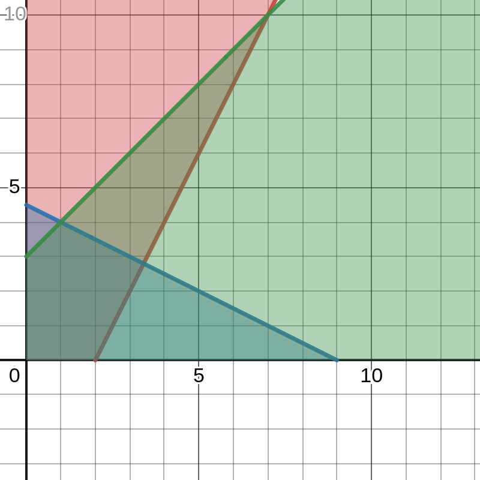

# heimaverkefni 9

# línuleg bestun í tveimur víddum
## a)
tökum skorðurnar og skiptum $x_1$ út fyrir $x$ og $x_2$ út fyrir $y$  
setjum svo þessar nýju formúlur inn í [desmos](https://desmos.com) og fáum eftirfarandi mynd:  

## b)
þrír skurðpunktar, þar af einn utan gjaldgenga svæðisins

## c)
fimm hornapunkta

## d)
setjum hnitagildin úr hornapunktunum inn í formúluna $2x_1 + 5x_2$ og fáum  
- $0 + 0 = 0$
- $4 + 0 = 4$
- $0 + 15 = 15$
- $2 + 20 = 22$
- $6.8 + 14.5 \approx 20$ 

## e)
eftir að reikna gildi markfallsins útfrá hornapunktunum má sjá að hámarksgilið er 22

# nefndir í háskóla

skorðurnar okkar eru:

1. í hverri nefnd þurfa að vera amk. **3** starfsmenn
2. hver starfsmaður má sitja í hámarki **3** nefndum
3. starfsmaður má ekki sitja í nefnd ef sá aðili er á svarta listanum

## 1.
setjum skorðu þannig fyrir hverja nefnd **j** þurfa að vera í henni amk. **3** starfsfólk, skilgreinum nýja breytu 
$K_{ij}$ sem skilar **0** ef starfsmaður **i** er ekki í nefnd **j** en annars **1**  
$$j\sum_{i=0}^{n}K_{ij} \geq 3$$

## 2.
höldum breytunni $K$ en notum hana núna til þess að athuga fyrir ákveðið starfsfólk **i**, hvort þau séu í fleiri en þremur nefndum
$$i\sum_{j=0}^k K_{ij} \leq 3$$

## 3.
nú þurfum við að athuga, fyrir allt starfsfólk allra nefnda, hvort sá aðili sé á svarta listanum fyrir eftirfarandi nefnd, við höfum nú þegar $K_{ij}$ sem segir til um hvort aðili **i** sé í nefnd **j**  
síðan höfum við líka $s_{ij}$ sem skilar **0** ef aðili **i** er ekki á svarta lista fyrir nefnd **j**  
beitum núna smá tvíundarreikningi og margföldum þessi gildi saman, ef við fáum ekki **0** þá fellur skorðan
$$\sum_{i=0}^n\sum_{j=0}^k K_{ij} * s_{ij} = 0$$

## formúla
ef að skorðurnar fyrir ofan standa viljum við svo að lokum lágmarka fyrir eftirfarandi summu 
$$\sum_{i=1}^k\sum_{j=1}^n p_{ij}*K_{ij}$$

# línuleg aðhvarfsgreining
¿que?