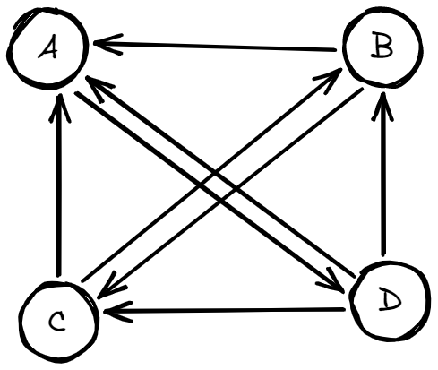
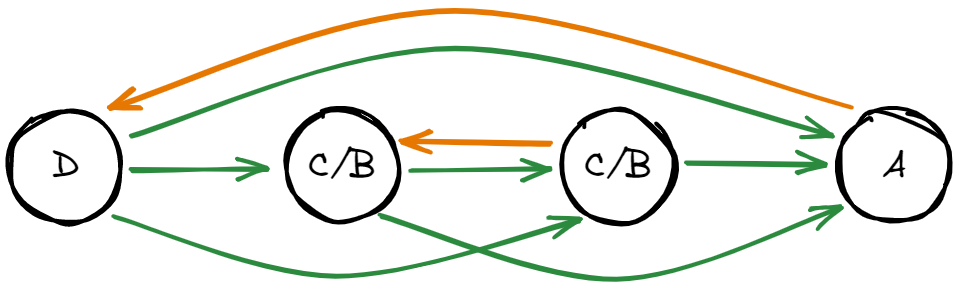
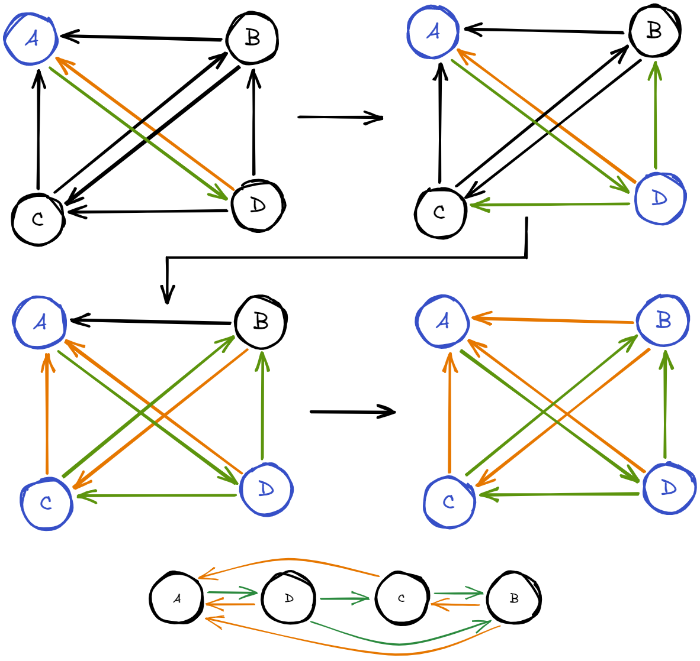
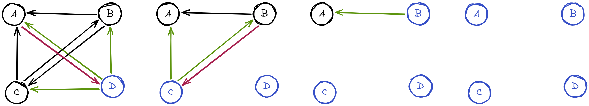

heimaverkefni 12
Þorvaldur Tumi Baldursson
---

# 1

# 2
Gefum okkur netið `G` sem inniheldur fjóra hnúta `[a, b, c, d]` og leggina `[da, db, dc, ca, cb, ba, bc, ad]` sem sýna hvernig hnútar eru tengdir. Þá er `G` eins og á myndinni hér að neðan.

ef við skoðum bestu lausn þá sést að það væri að raða hnútunum í röð $d -> c -> b -> a$ eða $d -> b -> c -> a$ þar sem leggir örvar benda til hægri eru **6** sjá mynd  

skoðum nú leiðir til þess að nálgast þessa niðurstöðu. Byrjum á að nota fara í gegnum netið og búa til röð af hnútum, þar sem aðgengilegir hnútar fara í röð, við notum þessa röð svo sem röðina okkar

byrjum í `a` og sjáum hvernig röðin verður.

með þessu fáum við **4** örvar sem benda til hægri sem er innan okkar skekkjumarka

en við getum ekki endilega notað þessa röð fyrir hvað sem er, hvað ef við hefðum ekki legg `ad` hvert færum við þá. endurhugsum þetta aðeins. 
- Finnum hnút sem hefur enga aðliggjandi leggi
  - í netinu okkar eru engir þannig veljum þann hnút með fæstu aðliggjandi leggi, það væri `d`. 
- Setjum þá `d` í röðina okkar og fjarlægjum alla hnúta sem snerta `d`.
- Endurtökum skref 1 og 2 þar til að enginn hnútur er eftir. Þá er röðin til, sjá mynd:

