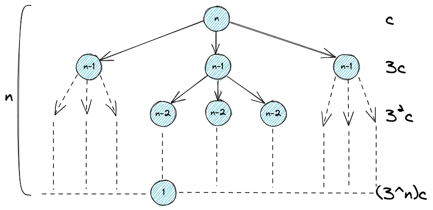
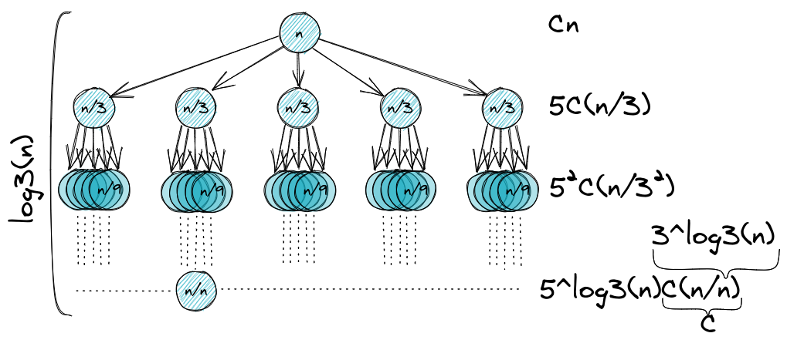
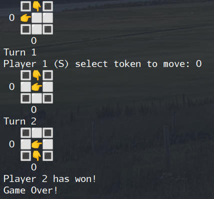
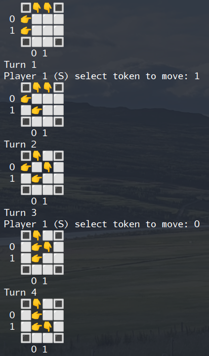
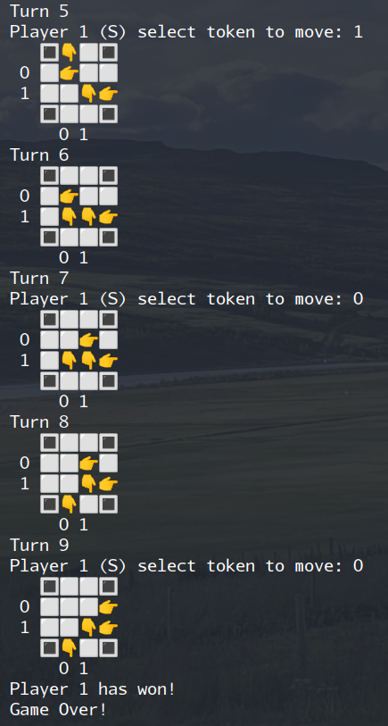
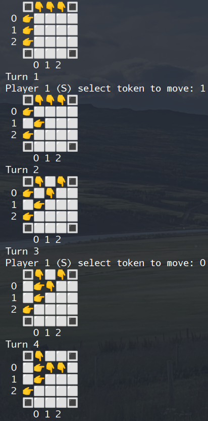
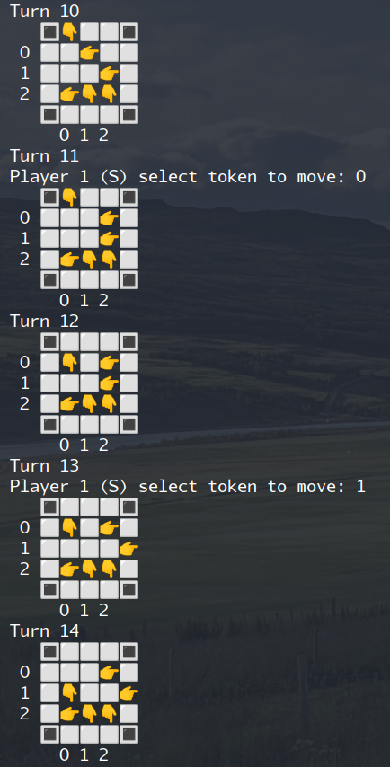
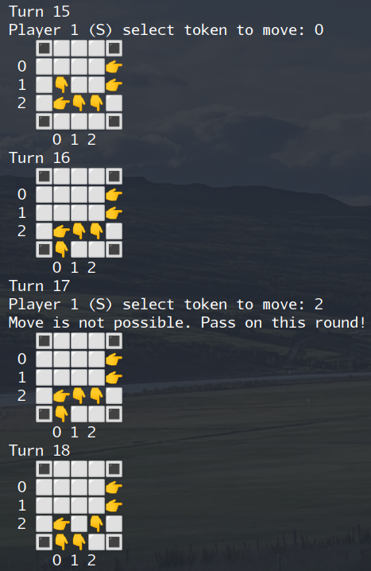
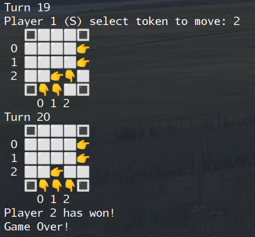

# Heimaverkefni 3 - Þorvaldur Tumi Baldursson

## 1. Rakningarvensl
### a)
  
hér er hægt að setja 
$T(n)$ fram sem summuformúlu, fast form og að lokum finna stóra O
$$\sum_{i=0}^{n} 3^i\cdot n = \frac{1}{2}c(3^{n+1}-1) = O(3^n)$$

### b)
  
sjáum mynd, hér er hæð trésins
$\log_3n$, með 
$5$ greinar á hverjum hnút og 
$O(n)$ tíma á hverjum hnút, vinnan fyrir dýpi k er þá
$$5^kc\frac{n}{3^k} = c\cdot \frac{5}{3}^k\cdot n$$
og heildarvinnan þá
$$cn \sum_{k=0}^n\frac{5}{3}^k = \frac{1}{2}c(5^{\log_3{n}+1}-3n)=O(5^{log_3{n}})$$

## 2. Samhverfur
fallið `split_into_palindrome(s, k)` notast við hjálparfall `is_palindrome(s)` til að auka lesanleika, 
eina sem hjálparfallið gerir er að athuga hvort strengur sé samhverfa og skilar `True` eða `False`  
```python
def is_palindrome(s):
    return s == s[::-1]


def split_into_palindrome(s, k):
    # skilar truthy, "tómum" streng af lengd 1, sem lokastöðugildi 
    if k == 0 and len(s) == 0:
        return " "
    for i in range(1, len(s)+1):
        if is_palindrome(s[:i]):
            # fer ekki inn í endurkvæmni nema núverandi hlutastrengur sé samhverfa
            temp = split_into_palindrome(s[i:], k-1)
            if len(temp) > 0:
                return s[:i] + " " + temp
    return ""


test_string = "BUBBASEESABANANA"
for i in range(2, 7):
    print(f"k={i} | {split_into_palindrome(test_string, i)}")
```
keyrsla á þessu prentar út
```
k=2 | 
k=3 | BUB BASEESAB ANANA  
k=4 | 
k=5 | B U B BASEESAB ANANA  
k=6 | B U BB ASEESA B ANANA  
```

## 3. Leikjatré

eftir útfærslu á reikniritinu á blaðsíðu 76 í bókinni er auðvelt að sýna fram á það að fyrir bæði `n=2` og `n=3` geta báðir spilarar unnið, með þessari útfærslu af reikniritinu er erfitt að prufa eitthvað með `n > 3` vegna þess hve rosalega hratt keyrslutíminn vex
> í þessum skrifuðu orðum er ég búinn að bíða í 3 tíma eftir því að tölvan ákveði fyrstu hreyfingu fyrir n=4
```python
def is_legal_move(player, T, token):
    temp1 = [x for x in [i.copy() for i in T]]
    if move_one_square(player, temp1, token):
        return True
    temp2 = [x for x in [i.copy() for i in T]]
    return move_two_squares(player, temp2, token)


def FindGoodMove(X, player):
    if has_won(player, X):
        return (True, 0)

    if has_won(player ^ 1, X):
        return (False, 0)

    for i in range(len(X[player])):
        if is_legal_move(player, X, i):
            state = [x for x in [i.copy() for i in X]]
            if not move_one_square(player, state, i):
                move_two_squares(player, state, i)
            if not FindGoodMove(state, player ^ 1, n+1)[0]:
                return (True, i)
    return (False, random.randint(0, len(X[player]) - 1))


```

og svo að lokum kóðbútur bætt í "game loopið" svo að tölvan geti gert sjálf
```python
while turn <= max_turns:
    # (turn, player) = comp_comp_turn(turn, player, T)
    turn += 1
    print("Turn " + str(turn))
    if player == computer:
        good_move = FindGoodMove(T, player, turn)
        # print(good_move)
        pos = good_move[1]
        pass
```

<div style='page-break-after: always;'></div>

### keyrsla fyrir n = 1


### keyrsla fyrir n = 2



### keyrsla fyrir n = 3




