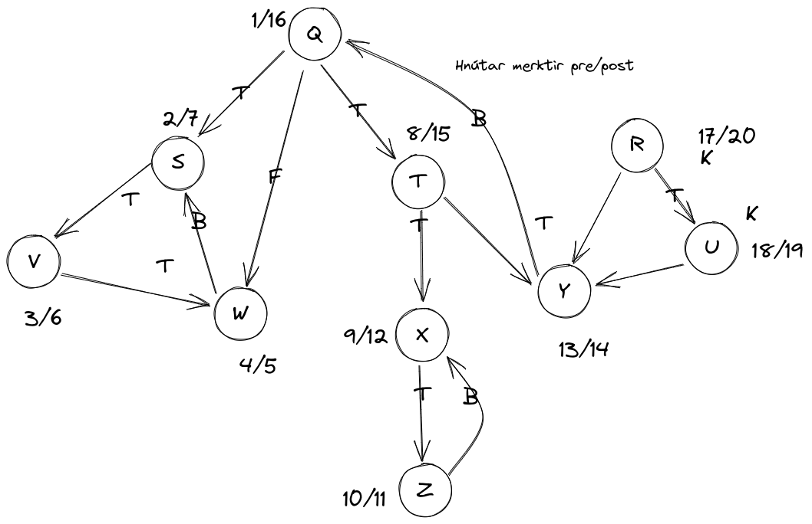

# verkefnatími 5

## 1. tvíhluta net
```python
def Samhangandi(s):
    put (null, s) into the bag
    while the bag is not empty:
        take (p, v) from the bag
        if v is unmarked
            # setjum lit á v sem andstæðu foreldris
            color(v) = color(p) ^ 1
            parent(v) = p
            for each edge vw 
                put w into the bag

        # ef litur á foreldri og núverandi 
        # hnút er sá sami, stoppaðu keyrslu
        else if color(p) = color(v) 
            return false

for s in graph:
    # afmerkjum alla hnúta
    unmark(graph)
    # ef við finnum hnúta sem uppfylla 
    # ekki samhangangdi net, hættum
    if !Samhangandi(s):
        return false
```

## 2. yfirfærsla

Reitir tákna leggi á leikborðinu
Leggir tákna löglega hreyfingu frá reit u til reit v.
Það eru k leggir út úr u, nema að stigi eða snákur sé á u,
þá er einn leggur til viðbótar, og stiginn er bætingin.

Leggirnir eru óvigtaðir og stefndir. Við notum BFS til þess
að geta vitað hvaða vegur er stystur. Vegna virknihæfni BFS,
er fyrsta leiðin sem við getum komist í endahnút stysta leiðin.
Við héldum utan um alla þá hnúta sem við komumst í og settum
staðsetningu leggja þeirra í fylki.

<div style='page-break-after: always;'></div>

## 3. djúpleit 



## 4. forkröfur
tökum gögnin og búum til stefnt net þar sem hnútar liggja frá `a` í `b` beitum dýptarleit og athugum hvort það séu bakleggir, sem segir til um að það sé ekki hægt að uppfylla kröfurnar 