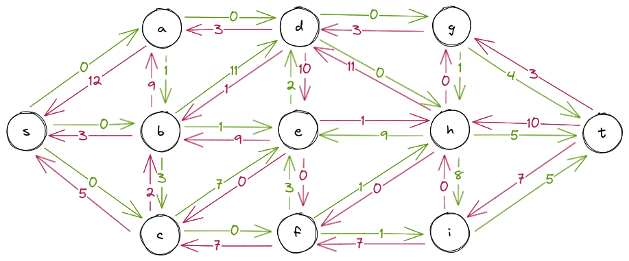

# heimaverkefni 7

## 1.
### a)
heildarflæði úr hnút *h* er $1+10=11$

### b)
heildargildi flæðisins í netinu er heildarflæði úr hnút *s* eða heildarflæði inn í hnút *t* sem er $3+5=8$ eða $2+1+5=8$ 

### c)
hér er myndin, grænir leggir tákna legg sem fer í upprunalega átt og rauðir eru öfugir, skiptir í raun engu setti bara inn til að auðvelda mér að teikna  

### d)
notum aukningarvegin 
$S \to b \to c \to f \to i \to T$ þar er flöskuhálsinn 
$c \to f$ því sá vegur leyfir aðeins aukningu flæðis um $2$

### e)
höldum aukningarveginum fyrir ofan og bætum við nýjum
- $s \to b \to d \to g \to t$ : flöskuháls $d \to g$ aukning um `1` 
- $s \to a \to b \to h \to t$ : flöskuháls $s \to a$ aukning um `9` 

þá er búið að hámarka flæði yfir netið þar sem ekki er hægt að taka meira út úr hnúti s, hámarksflæðið er þá 20  

### f)
þar sem það er búið að finna hámarksflæði getum við leitað að leggjum þar sem summa flæðis úr s yfir í t er jöfn hámarkflæðinu, teiknum það inn á netið okkar og fáum:  

## 2. 
### a)
við getum afsannað að öll net hafi legg sem er takmarkandi að ofan með mótdæmi, sjá:  
ef við höfum flæðisnetið 
$s\to a\to t$ þar sem allir leggir hafa rými 1 og við hækkum rými á 
$a$ um einn þá breytist heildarflæði netsins ekki neitt

### b)
við getum sýnt fram á að öll net hafi legg sem er takmarkandi að neðan, sjá:  
öll net frá `s` yfir í `t` hafa allavega einn hnút sem tengist yfir í `t`, látum netið vera $s\to a\to t$ þar sem allir leggir hafa rými 1,  
minnkum nú rými á `a` um einn og sjáum að heildarflæði flæðisnetsins minnkar um 1  
þetta er afmarkað dæmi en við getum alltaf fundið hnút `v` sem er tenging við stærri hluta netsins við `t` og ef við minnkum rými þessa hnúts þá minnkar heildarflæði netsins alltaf um 1

## 3. 
við viljum setja fram skilgreint reiknirit sem athugar hvort hámarksflæði nets `G` sé einstakt.  
- fyrsta skref væri að finna hámarksflæði, við gerum það í `O(vE)` tíma
- næst þá tökum við netið og fyrir alla leggi í hámarksflæðinu:
  - gerum nýtt net þar sem einum legg er breytt þannig að rýmið í honum sé minna en núverandi flæði yfir hann
  - athugum hámarksflæði yfir þetta nýja net
    - ef hámarksflæðið er minna þá vitum við ekki hvort netið sé einstakt strax, færum okkur yfir á næsta net og athugum endurtökum þetta skref
    - ef hámarksflæðið er jafnt og upprunalega hámarksflæðið þá er hámarksflæðið ekki einstakt og við hættum keyrslu
  
þar sem við þurfum að finna nýtt hámarksflæði fyrir alla leggi í upphaflega hámarksflæðinu, eða alla leggi í netinu, þá erum við að reikna hámarksflæði `E` sinnum eða
$E\cdot O(VE) = O(VE^2)$ 
