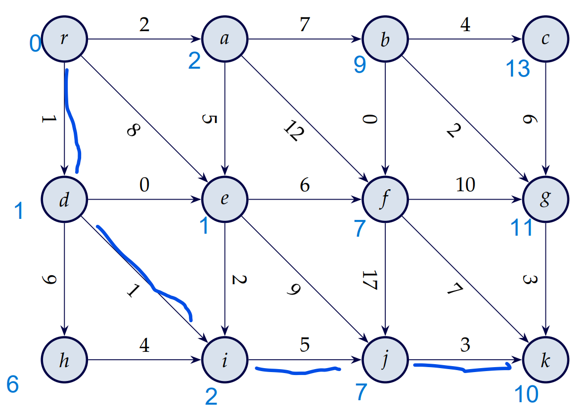

# verkefnatími 6

## 1. stystu vegir
### a)
ef við notum `SSSP` sem hefur tímaflækju 
$O(|V|+|E|)$ en þar sem við getum sett efri mörk á fjölda leggja fyrir þetta net, við sjáum alla leggi, getum við haldið því fram að tímaflækjan sé 
$O(3\cdot |V| + |E|)$ þar sem 3 er hámarks gráðutölu netsins,
það er svo hægt að stytta enn fremur yfir í 
$O(4\cdot |V|) = O(|V|)$ 

### b)

## 2. stystu vegir
### a)
ef við höfum tvær stystu leiðir sem eru jafn langar en hafa mismarga leggi, þá getur aðferðin hans Georgs ruglað í netinu, sjá mynd:  
    

### b)
við viljum finna stysta veg og velja þann veg sem hefur færri leggi ef við lendum í jafntefli á vegum,
við keyrum Dijkstra einu sinni og fyrir hvern legg sem við finnum leggjum við 
$\frac{1}{|E|}$ við vogtöluna til að tryggja að við förum ekki og breytum stysta veg

### c)
Bellman-Ford reikniritið stoppar keyrslu og skilar engu ef það finnur einhverja neikvæða hringrás.
í fyrsta skrefinu okkar erum við að snúa við öllum vogtölum og gera mínustölur úr plústölum og öfugt,
þetta getur gert neikvæðar hringrásir úr jákvæðum hringrásum sem fyrir viðsnúninginn hefðu verið ekkert mál,
en núna því við snérum öllu við, getur reikniritið ekki fundið stystu leið og þar af leiðandi ekki fundið lengstu leið

## 4. verkröðun
ef það á að vinna öll verkefnin í G(V,E) skiptir ekki í máli hvaða röð við vinnum verkin þar sem summa allra hnúta er sú sama, sama í hvaða röð hún er reiknuð 😎