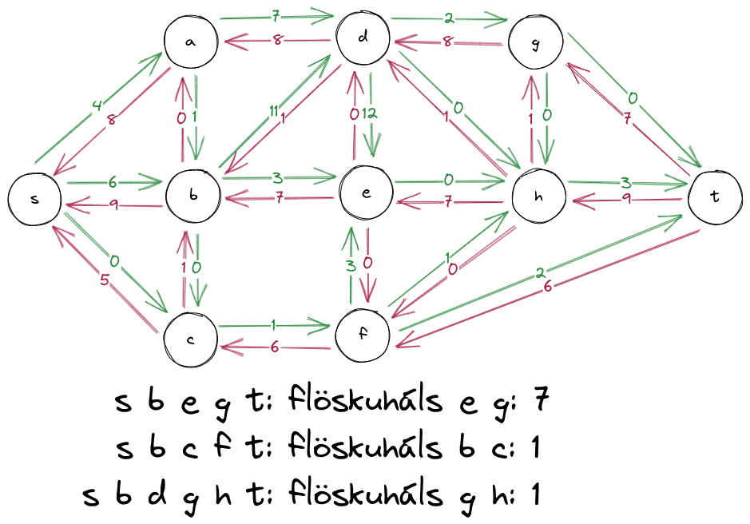
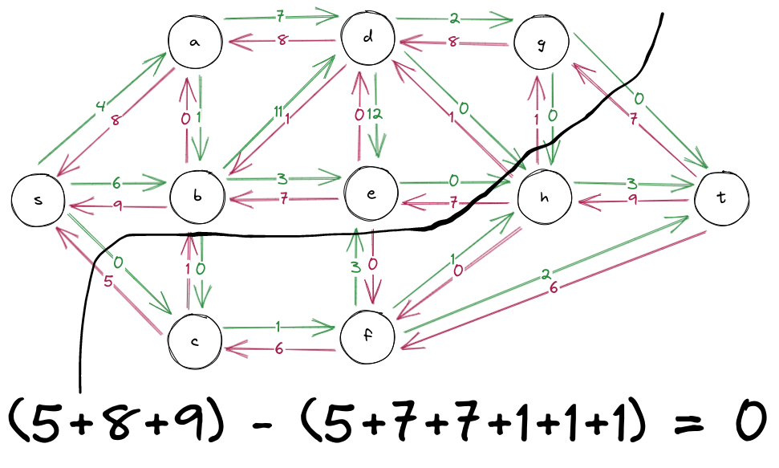

# tímadæmi 8

## 1.
### a)
heildargildi flæðis er 
$7+1+5=13$

### b)
dæmi um aukningarveg væri 
$s\to b\to e\to h\to t$

### c)

### d)

### e)
já það er til afskaplega skrautleg og löng sönnun sem sýnir það að það sé alltaf til $s-t$ snið sem er $0$

## 2.
## 