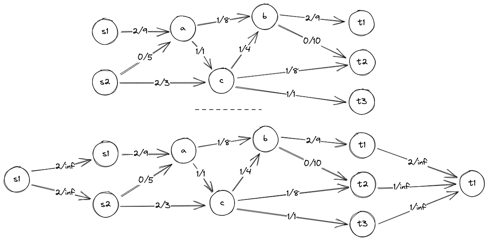
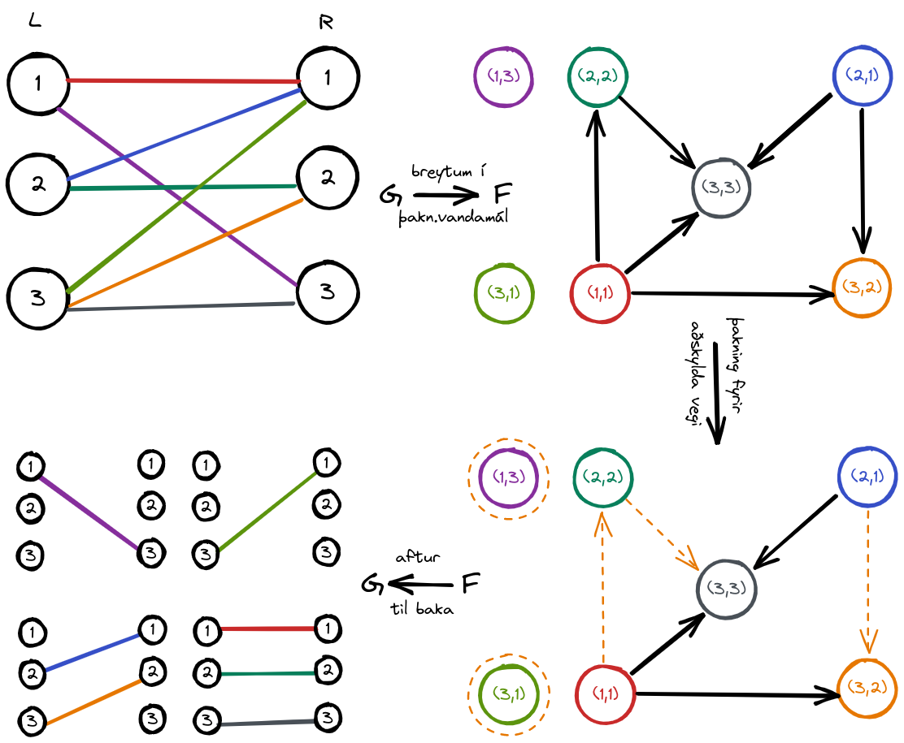
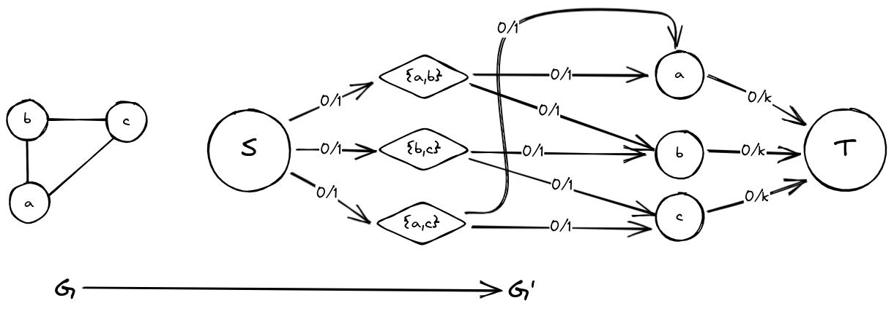

# heimaverkefni 8


## 1. fleiri uppsprettur og niðurföll
ef við ímyndum okkur að við höfum hnúta 
$s_0$ og 
$t_0$ þar sem rými úr 
$s_0$ og rými inn í 
$t_0$ eru bæði 
$\infty$

tengjum núna þessa nýju hnúta við þá sem voru upphaflega í flæðisnetinu það mun þá líta svona út:  



nú erum við búin að leysa kjarna vandans, að vera með marga $s$ og $t$ hnúta

þessi aðferð virkar líka fyrir net sem hafa hnúta sem eru bæði upphafs og endahnútar á sama tíma, við þurfum samt að bæta við einu skrefi til að það virki  
> fyrir alla hnúta V sem eru bæði upphafs- og endahnútar skiptum við þeim upp í tvennt, fyrir hnút $V_i$ yrði skiptingin $SV_i$ og $TV_i$ þar sem flæðið á milli leggjana ákvarðaðist af $w_i$

## 2. sundurliðun tvíhlutanets...
við höfum G sem er tvíhluta net með hnúta 
$L \cup R$ og leggi E. 
tökum núna afrit af þessu neti og breytum því þannig að hver leggur sé hnútur með nafn 
$(L_i, R_j)$ og tengjum þessa hnúta þannig að þeir uppfylli
$i < i'$ þ.þ.a.a
$j < j'$, köllum þetta net F

fyrir þetta net keyrum við *blackbox* reikniritið **ÞFAV**

skoðum sýnidæmi fyrir þessa aðferð á nýju neti G:  



**sauðakóði?? áhersla á sauða**
```rust
let F = G.edges().map(|e.u, e.v| Node(e.u, e.v)) // búum til nýtt net F úr leggjum G
for current in F.nodes() { // ítrum yfir alla leggi í nýja netinu
    for adj in F.nodes().filter(not current) { // og athugum fyrir alla aðra hnúta en núverandi
        if current.u < adj.u && current.v < adj.v { // hvort hægt sé að tengja samkvæmt reglu
            F.connect(current, adj) // og tengjum ef svo er
        }
    }
}

let decomp = F.dpc() // keyrum "black box" reikniritið disjoint path coverage
for road in decomp.roads { // ítrum yfir alla aðskilda vegi F 
    G.show(road.edges) // og sýnum tilheyrandi vegi úr G
}
```
> *þakning fyrir aðskilda vegi

<div style='page-break-after: always;'></div>

## 3. áttun á óstefndu neti
**Yfirfærsla**
- búum til nýtt flæðisnet **G'** þar sem að hver leggur í upphaflegu netinu **G** myndar hnút $\{U,V\}$  
- tengjum síðan hnút **S** yfir í nýju hnútana okkar og látum leggi **S** hafa rými 1  
- næst búum við til nýja hnúta í **G'** sem samsvara hnútunum úr **G** og tengjum $\{U,V\}$ hnútana inn í þessa nýju hnúta,
    - hnútur **{A, B}** tengist inn í hnúta **A** og **B**
- að lokum tengjum við hnútana úr **G'** sem samsvara hnútunum úr **G** yfir í **T** með rými **K** 

keyrum Ford-Fulkersson á þetta og fáum hámarksflæði fyrir nýja netið, ef hámarksflæðið mettar ekki alla leggi úr **S** þá getum við sagt að ekki sé hægt breyta netinu í stefnt net þannig að innstig allra hnúta sé í mesta lagi **K**



fyrir þessa útfærslu þarf að búa til **|E|** nýja hnúta og keyrsla þannig tímaflækjan fyrir yfirfærslu er **O(E)** en þar sem tímaflækja fyrir Ford-Fulkersson er **O(EV)** þá endum við með tímaflækju **O(EV)**